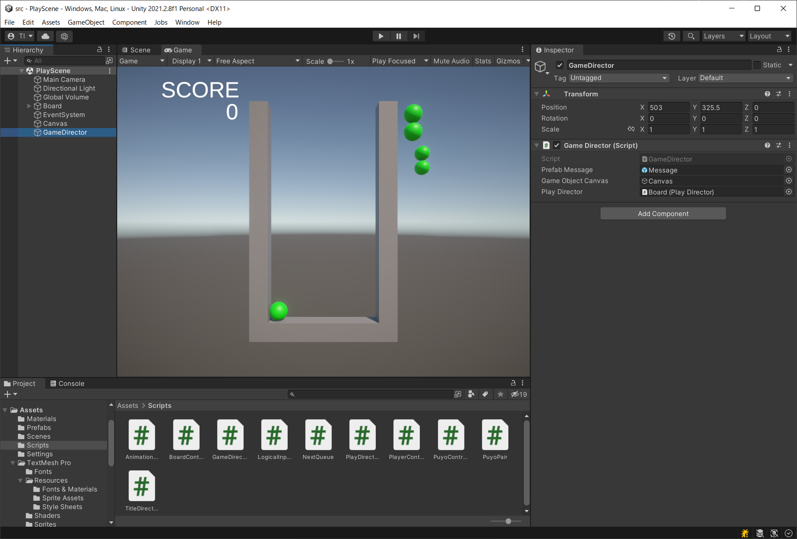

# 概要
今回はタイトル画面を作って、ゲームらしくします。

https://user-images.githubusercontent.com/936545/155517012-d43a11c7-16ed-42f9-9dee-1bfead4bb180.mp4

# 手順

## タイトル画面
### シーンの作成

最初にタイトル画面を作りたいと思います。
今回は、静的な画面をタイトル画面にしたいと思います。

まずは、シーンを作成します。Peoject ウィンドウのAsset-Scenesフォルダにシーンを追加して、「TitleScene」という名前にしました。
また、今までのシーンは、「PlayScene」という名前にしました。

この TitleScene が最初に立ち上がるシーンになります。
起動時のシーンの設定は、メニューの「File」-「Build Settings」で行います。

- 「Scenes In Build」に、「Add Open Scenes」を押して「TitleScene」を追加
- 「Scenes/TitleScene」を一番上に移動

### 画面の作成

次に、画面を作って行きます。Hierarchyウィンドウからオブジェクトを追加します。
 - Canvasを追加: 文字を置くための下地を引きます。この後のテキストはこのCanvasの子オブジェクトとして登録します。
 - Text - TextMeshPro を追加(Title Text): タイトル「Puyo Study」をテキストフィールドに入れました。
 - Text - TextMeshPro を追加(Press START Text): メッセージ「Press START」をテキストフィールドに入れました。

それぞれのテキストには、アンカーや位置を見た目でイイ感じになるように作ります。
いくつかの解像度やアスペクト比で家訓してみると良いでしょう。
ここでは、アンカーは画面の中心に、
テキストの Alignment も上下、左右に中央揃えにして、
画面中心を基準にした配置にしました。
色やフォントサイズも適当に決めています。

背景の色は、カメラ設定で行っています。
カメラのコンポーネントの「Environment」の「Background Type」を
「SolidColor」にすると、背景を固定色にできます。
その下の「Background」で背景色をかっこよく決めていきます。

### シーンの遷移

タイトル画面を素敵に作成したら、ゲームに組み込みましょう。
まずは、スクリプトを追加します。
- 画面遷移用のスクリプト「TitleDirector.cs」を作成
- ゲームオブジェクト「TitleDirector」を作成
- ゲームオブジェクトにスクリプトをドラッグアンドドロップで設定

その後、何かキーを押したら、シーンを遷移するようにします。
いずれかのキーの入力は、「Input.anyKey」で取得可能です(17行目)。
シーンの遷移は、「SceneManager.LoadScene」で可能です。
SceneManager を使う際には、「using UnityEngine.SceneManagement」を追加します(24行目)。

今回、LoadScene を直接呼ばずに、Invoke メソッドを使っています(19行目)。
これは簡単に遅延処理を実行する方法です。
ボタンを押した瞬間に画面が切り替わるのは、唐突なので、
通常はしばらく待って（音やエフェクトで演出をしながら）
画面を切り替えます。
今回は、1秒待って画面を切り替えようと思います。
Invokeは、このような処理を行うのに最適で、
第一引数で指定したメソッドを第二引数だけ待ってから実行します。
従って、ボタンを押されたら、1.0秒待って、ChangeSceneメソッドが呼ばれます(19行目)。
ChangeSceneメソッドは、即座にPlaySceneを読み込んで、シーンを切り替えます(24行目)。

## ゲームディレクターの導入

今までは、ゲームを開始するとすぐにぷよぷよが落ちてきました。
実際のゲームでは、開始演出が入ってゲームは始まります。
また、ゲームオーバーになった時も、すぐに終わるのではなくて、
悲しい雰囲気の演出が行われることがほとんどです。
これらを実現したいと思います。

### ゲームディレクターオブジェクトの追加

これら演出の流れを制御するスクリプトを導入します。
ゲームディレクターという存在として、これらスクリプトや関係するゲームオブジェクトを追加しましょう。
- スクリプト「GameDirector.cs」を追加
- ゲームオブジェクト「GameDirector」を追加
- 「GameDirector.cs」をゲームオブジェクト「GameDirector」にバインド

## ゲームの流れ

### PlaySceneの流れ
ゲームディレクターが監督するPlaySceneの流れは、次のようになります。
- 「Ready?」を1秒表示
- あそぶ
- 「Game Over」を1秒表示
- タイトルに戻る

### yield による流れの処理

ゲームの流れは、一直線です。このような処理では、yield を使うと簡単に記述することができます。

yield は、「yield return」で関数を終えると、次に処理を呼ばれた際に、
続きから処理できるというものです。
例えば、「yield return new WaitForSeconds(秒数);」で、指定した秒数だけ処理を一次中断できたり(35, 52行目)、
「yield return null;」で、次のフレームに続く処理を実行してくれます(42, 49行目)。
これを使って、一時的に中断する場所をはさみながら処理を記述すれば、
ほぼ、流れを書くのとそのままの形で処理を記述することができます。

なお、「CreateMessage」は、ローカルなメソッドで、「playDirector.EnableSpawn」と「playDirector.IsGameOver」は、今回追加するメソッドです。
それ以外は、UnityやC#の言語仕様やAPIになります。
yield を使う処理を書く場合には、「IEnumerator」インターフェイスを返り値とする
関数として記述して(31行目)、StartCoroutineメソッドで関数名を文字列で指定して呼び出します。
「CreateMessage」でメッセージのゲームオブジェクトを生成するのですが、それらを削除しているのがDestroyです。

### メッセージの表示

他に GameDirector クラスが行っているのがメッセージ表示です。
今回は、ルートにCanvasのオブジェクトを追加して、そのオブジェクトを親として
プレハブをインスタンス化します(18-19行目)。
インスタンス化する際は、ワールド座標で位置を指定しますが、
ローカル座標での原点に置きたかったので、生成した後に位置を指定しています(20行目)。

プレハブやキャンバスは、GameDirectorのゲームオブジェクトで設定します(上記「ゲームディレクターオブジェクトの追加」でのキャプチャ画像参照)。

メッセージで使っているプレハブですが、今回新しく作った物です。
ヒエラルキーウィンドウに「Text - TextMeshPro」のオブジェクトを「Message」という名前で作成して、画面の中央に表示されるように設定します。
後は、プロジェクトウィンドウにドラッグ&ドロップして、プレハブ化した後に、GameDirector のインスペクターに設定します。

今回の具体的なプレハブの内部の設定は、次のようにしています。

## 開始待ち機能

あと、実装しなくてはならない機能は、PlayDirector で処理しているゲームの実行において、Ready?の表示が消えるまでに始まりを待つことです。

ゲームの動きを止めておいて、GameDirectorが「EnableSpawn」メソッドを呼び出したらゲームを開始するように修正します。

今回、ゲームの動きを止めるのに、ぷよぷよを新規に出さないことで対応します。
これにより、最初にふってくるぷよがいれば、それは演出中に落とすことができます。
ぷよぷよを出さないためのフラグとして、「_canSpawn」メンバーを追加します(43行目)。
初期状態では、falseになっていて、EnableSpawnメソッドを呼ばれたら、ぷよぷよが降ってこれるようにします(216行目)。

なお、ゲームオーバーの判定も追加しました。これは、PlayDirectorの状態がゲームオーバーになっているかどうかで判定できます。

実際にぷよぷよを振らせないための方法ですが、今回は、状態を追加しました。
「Waiting」状態を追加して(15行目)、対応するクラス「WaitingState」もstates配列に追加します(52行目)。

WaitingStateクラスは基本的には何もしないで、「_canSpawn」フラグが立ったらContorl状態に移行します(109行目)。

Waiting 状態への遷移ですが、これは、今までControl状態に遷移していた部分を
_canSpawnメンバーを見て、Waiting状態に遷移させます。
具体的には、Erasing状態の初期化処理で消すぷよがなかった際に Control 状態に
移項していたので、これを _canSpawn が立っていなかったら、Waiting 状態に変化させます(156行目)。

なお、ぷよぷよをすぐに落とさないことによって、
NEXTぷよの表示が直ぐには行われないという事が判明しました。
従って初期化処理で、NextQueueを初期化した直後に、
NEXTぷよの表示を更新しています(64行目)。

# 検証

タイトルのシーンからはじめて、
ゲームを終えると再びタイトルに戻れば正解です。

音は入っていないし、対戦はできませんが、一通りゲームと呼べるものになったのではないでしょうか。